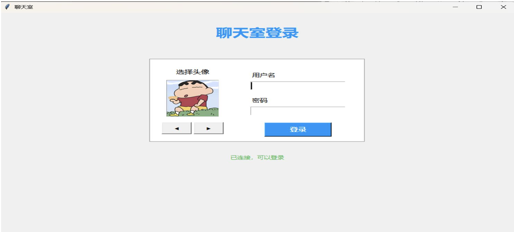
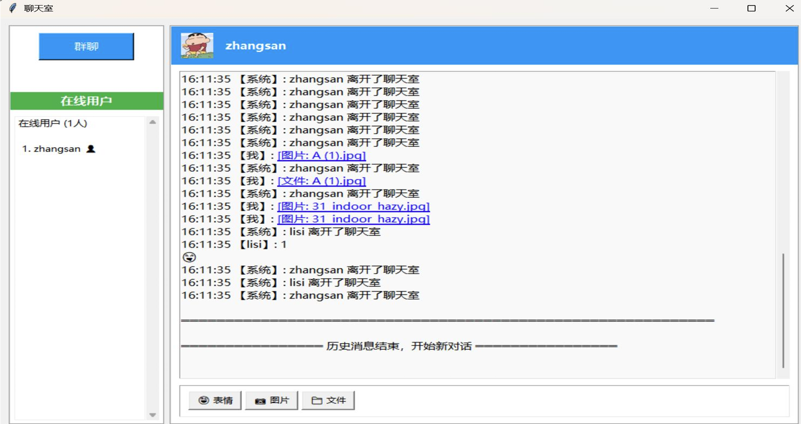

<p align="right">
  <a href="./README.md"></a>
  <a href="./README_EN.md"></a>
</p>

# TCPChatRoom

A LAN chat room demo based on Java Socket + Swing. Features include:
- Login and online user list
- Group chat
- Private chat
- Emoji, image, and file messages
- MySQL chat history persistence

## UI Preview

Login page:



Main chat page:



## Project Structure

```text
TCPChatRoom/
├─ assets/
│  ├─ 1.png
│  └─ 2.png
├─ src/chat/
│  ├─ ChatServer.java        # Server entry
│  ├─ ChatClientMain.java    # GUI client entry
│  ├─ ChatClientGUI.java     # GUI logic
│  ├─ ClientHandler.java     # Per-connection server handler
│  ├─ ClientReceiver.java    # Client receiver thread
│  ├─ DBUtil.java            # MySQL read/write
│  ├─ ChatClient.java        # CLI test client (legacy)
│  └─ avatars/               # Static resources (currently unused)
├─ lib/mysql-connector-j-9.1.0.jar
├─ sql/init_chatroom.sql
└─ scripts/smoke_test.py
```

## Requirements

- JDK 17
- MySQL 8.x
- IntelliJ IDEA (recommended, `.idea` is already configured)
- Python 3.7+ (only for smoke test script)

## Database Initialization

1. Make sure MySQL is running.
2. Run:

```sql
SOURCE sql/init_chatroom.sql;
```

3. To change DB connection settings, edit these fields in `src/chat/DBUtil.java`:
- `URL`
- `USER`
- `PASSWORD`

Default values:
- Database: `chatroom`
- User: `root`
- Password: `123456`

## Run (IntelliJ)

1. Open the `TCPChatRoom` project root.
2. Set Project SDK to JDK 17.
3. Run `chat.ChatServer` first.
4. Run one or more instances of `chat.ChatClientMain`.

## Run (Command Line, Optional)

From project root:

```powershell
javac -encoding UTF-8 -cp "lib/mysql-connector-j-9.1.0.jar" -d out/production/TCPChatRoom src/chat/*.java
java -cp "out/production/TCPChatRoom;lib/mysql-connector-j-9.1.0.jar" chat.ChatServer
```

In another terminal, start client:

```powershell
java -cp "out/production/TCPChatRoom;lib/mysql-connector-j-9.1.0.jar" chat.ChatClientMain
```

## Protocol (Text Lines)

- Login: `LOGIN|username`
- Group chat: `CHAT|username|content`
- Private chat: `PRIVATE|sender|receiver|content`
- Emoji: `EMOJI|username|emoji`
- Image: `IMAGE|username|base64`
- File: `FILE|username|fileName|base64`
- Online users (server push): `USERLIST|u1,u2,...`

## Smoke Test

After server starts:

```powershell
python scripts/smoke_test.py --host 127.0.0.1 --port 8888
```

The script verifies:
- Login broadcast
- Group chat broadcast
- Private message routing
- File message broadcast
